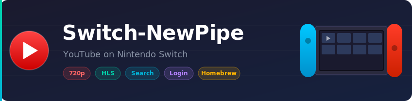

<p align="center">
  
</p>

<p align="center">
  <strong>A free, open-source YouTube client for Nintendo Switch homebrew.</strong><br>
  Inspired by <a href="https://github.com/TeamNewPipe/NewPipe">NewPipe</a> &mdash; no Google account required, no ads, no tracking.
</p>

---

## About this fork

This is [mirusu400/switch-newpipe](https://github.com/mirusu400/switch-newpipe) with the
interface reworked for the **Switch OLED**. Nothing about what the app *does* has
changed: same tabs, same controls, same playback pipeline, same data files, same
`.nro`. What changed is how it looks and how it feels while you use it.

### Endless feeds

Home, Search and Subscriptions used to fetch one fixed block of results (16-24
videos) and stop there. They now carry YouTube's continuation token and keep
loading as you scroll: the next page is requested while the bottom of the list
is still more than a screen away, so scrolling never actually hits an end.

### The UI no longer freezes

Every network call ran inline on the UI thread, so the whole interface - the
sidebar, the animations, the loading spinner itself - locked up for as long as
YouTube took to answer. Opening a feed, searching, pressing **A** on a video and
opening the channel/related/comments screens all run on a worker thread now, and
only the finished result comes back to the UI.

### Cards that line up, text that fits

- Video cards are a fixed height, so rows line up and the bottom row is no
  longer sliced through the middle of a sentence.
- Titles get two lines and ellipsise instead of pushing the rest of the card
  out of shape; focusing a card scrolls the full title.
- Duration (or a red **LIVE** pill) sits on the thumbnail where YouTube puts it,
  which frees the row under it for views and upload date.
- The thumbnail keeps its 16:9 slot open before the image arrives, so rows stop
  jumping around while a feed loads in.
- The sidebar is icon-only — no names under the icons — so it is a narrow strip
  of 100px instead of 180, and the feed gets the width back.
- The comment list had a line-height bug that spaced every comment apart by
  hundreds of pixels; comments are now readable cards.

### Things move

Nothing in the old UI animated except the focus highlight; everything else cut
straight from one state to the next.

- Cards fade and rise into place, staggered behind each other, so an appended
  page rolls in instead of appearing all at once.
- The focused card lifts off the grid.
- Thumbnails ease in as they arrive rather than popping into a grey hole.
- Switching tabs fades the incoming content, and the sidebar's accent bar and
  active icon fade with it.
- Spinners and the "loading more" footer fade in and out instead of blinking
  into existence for a frame.

### Tuned for the OLED panel

The background is true black rather than `#121212`. On an OLED that is both a
deeper-looking picture and less panel power, and every surface above it steps up
from black in small increments so cards stay separable without glowing. The rest
of the borealis chrome (frame, sidebar, dialogs, focus glow) was pulled onto the
same palette instead of its default grey.

## Install

1. Make sure your Switch has **Atmosphere CFW** with the Homebrew Menu
2. Build the `.nro` (see below) or download it from the Actions artifacts
3. Copy it to `sdmc:/switch/switch_newpipe.nro`
4. Launch from the Homebrew Menu

## What You Can Do

- Browse **Home**, **Search**, **Subscriptions**, **Library**, and **Settings**
- Watch YouTube up to **1080p** in docked mode (**720p** handheld) — HLS streaming, no throttle
- Search for any video and play it immediately
- Log in with cookies to see your subscriptions and personalized recommendations
- Save watch history and favorites locally
- English & Korean UI

## Controls

### Main UI

| Button | Action |
|--------|--------|
| `A` | Play video from list |
| `Y` | Open video details |
| `X` | Refresh / Reset defaults |
| `RB` | Manage login session (Subscriptions tab) |

### Player

| Button | Action |
|--------|--------|
| `A` | Pause / Resume |
| `B` | Exit player |
| `Up / Down` | Volume |
| `Left / Right` | Seek 10 seconds |
| `LB / RB` | Seek 60 seconds |
| `X / Y` | Toggle OSD overlay |

On progressive and UMP streams you can only seek inside the part that has already
been downloaded; the OSD progress bar shows that range and the reachable limit.

## Login (Optional)

Switch-NewPipe uses cookie import for YouTube login. No OAuth or Google sign-in required.

**How to set up:**

1. Export your YouTube cookies from a browser (using a cookie export extension)
2. Save the file as `sdmc:/switch/switch_newpipe_auth.txt`
3. Restart the app

Supported formats: raw `Cookie` header, JSON `{"cookie_header":"..."}`, or Netscape `cookies.txt`.

Once logged in, your **Subscriptions** tab and **personalized Home recommendations** will be available.

## Playback Quality

Configure in **Settings** tab:

| Mode | Description |
|------|-------------|
| **Best** | Auto by console state: **1080p when docked**, **720p in handheld** |
| **1080p** | Always target 1080p (HLS), falls back gracefully |
| **720p** | Always target 720p (HLS), falls back gracefully |
| **320p** | Low quality (~360p progressive MP4) to save bandwidth |

## Data Files

All data is stored on your SD card:

| File | Purpose |
|------|---------|
| `sdmc:/switch/switch_newpipe.log` | Debug log |
| `sdmc:/switch/switch_newpipe_settings.json` | Settings |
| `sdmc:/switch/switch_newpipe_library.json` | Watch history & favorites |
| `sdmc:/switch/switch_newpipe_session.json` | Login session |
| `sdmc:/switch/switch_newpipe_auth.txt` | Cookie import (you provide this) |

## Build from Source

A `.nro` cannot be produced on Windows; the build runs the devkitPro toolchain
inside Docker. Two ways to get one:

### GitHub Actions (no local toolchain)

Push this repo to GitHub. `.github/workflows/build.yml` builds on every push and
uploads `switch_newpipe.nro` as a workflow artifact. The first run takes about
15 minutes because ffmpeg and mpv are compiled from source for the Switch; every
run after that restores them from the Actions cache and finishes in a few.

### Locally (Linux/macOS, or Windows via WSL)

Requires Docker and a host C++ compiler.

```bash
git clone --recursive <this repo>
cd switch-newpipe-oled
./build.sh              # full build (portlibs + app)
./build.sh --app-only   # app only, after the first full build
./build.sh --clean      # start over
```

Output: `cmake-build-switch/switch_newpipe.nro`

<details>
<summary>Host validation tools (for development)</summary>

```bash
make host
./build/host/switch_newpipe_host
./build/host/switch_newpipe_host --search Zelda
./build/host/switch_newpipe_host --resolve 'https://www.youtube.com/watch?v=dQw4w9WgXcQ'
```

</details>

## Where the UI lives

| Path | What it holds |
|------|---------------|
| `resources/xml/` | Every screen's layout, including the video card |
| `src/view/stream_card.cpp` | Card contents, title splitting, duration badge |
| `src/view/stream_grid.cpp` | The shared, append-only card grid |
| `src/view/paging_scrolling_frame.cpp` | Asks for the next page before the bottom |
| `include/view/fade.hpp` | The fade-in / fade-out helper the spinners use |
| `src/view/auto_tab_frame.cpp` | Sidebar item template and the tab-switch fade |
| `src/common/async_runner.cpp` | The worker thread every network call runs on |
| `src/main.cpp` | Theme colours and sidebar metrics |

## Known Limitations

- Seek is not yet supported
- No in-app quality picker during playback
- No in-app Google OAuth (cookie import only)
- Channel pages are not fully browsable yet
- Comments and playlists load first page only

## Tech Stack

- **UI**: [Borealis](https://github.com/natinusala/borealis) (native Switch UI framework)
- **Playback**: mpv + FFmpeg (hardware-accelerated on Switch)
- **Networking**: libcurl + custom YouTube innertube API client
- **Build**: CMake, Docker, devkitPro toolchain

## License

Upstream project by [mirusu400](https://github.com/mirusu400/switch-newpipe); see
`LICENSE.MD`. This project is for educational purposes. It is not affiliated with
YouTube, Google, or NewPipe.
